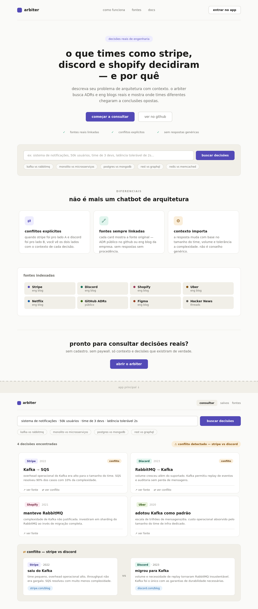

# Arbiter

Buscador de decisões reais de engenharia. Descreva o contexto do problema e veja o que times como Discord, Figma, Uber e Shopify decidiram — com fonte linkada e detecção automática de conflito quando empresas chegaram a conclusões opostas sobre a mesma tecnologia.

## Demo



## Funcionalidades

- **Busca contextual** — encontra decisões por tecnologia, problema ou contexto
- **Detecção de conflito** — exibe automaticamente quando a mesma tecnologia foi adotada por uma empresa e rejeitada por outra
- **108 decisões reais** — corpus curado com fonte linkada em cada card
- **Filtros** — por tópico, veredicto (adotou / rejeitou / manteve) e empresa
- **Modal de detalhe** — contexto completo, razão ancorada, decisões opostas e relacionadas
- **Salvos** — salve decisões para comparar depois, exporte como `.md`
- **Dark / light mode** — persiste entre sessões
- **URL compartilhável** — cada busca, tópico e decisão tem URL própria
- **Command palette** — `Ctrl+K` para navegação rápida

## Rodar localmente

```bash
npm run dev
```

Abra `http://localhost:5173`. Sem build step — o servidor usa apenas Node.js nativo.

## Stack

- HTML5 + Tailwind CSS CDN
- JavaScript vanilla (ES modules)
- Node.js como servidor estático simples
- Corpus versionado em `data/decisions.json`

## Expandir o corpus

O pipeline de ingestão extrai decisões de posts de engenharia usando Claude:

```bash
cd tools
cp .env.example .env          # adicione sua ANTHROPIC_API_KEY
pip install anthropic

python extract.py https://eng.uber.com/aresdb/          # visualiza
python extract.py https://eng.uber.com/aresdb/ --append # adiciona ao corpus
```

O script valida os campos, detecta conflitos contra o corpus existente e exibe o JSON extraído antes de escrever.
